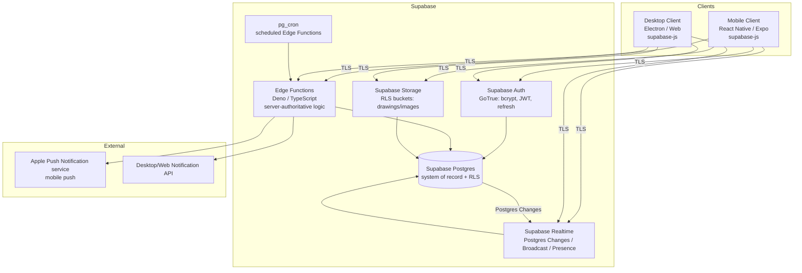
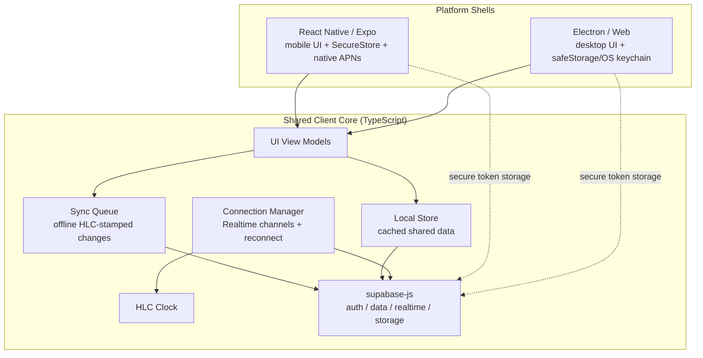
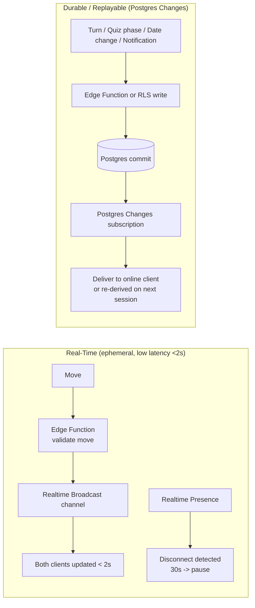
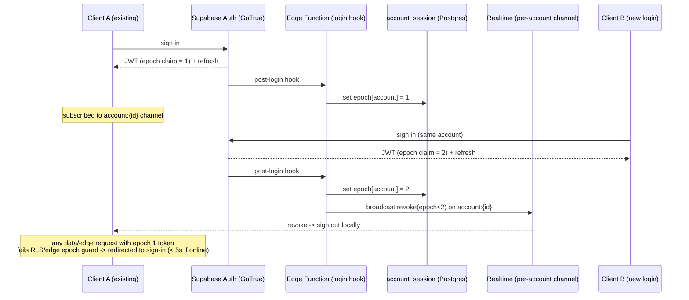

# Design Document

## Overview

The LDR Companion App is a cross-platform (mobile + desktop) application that lets two people in a long-distance relationship link their accounts into an exclusive one-to-one pairing and share games, quizzes, and a calendar of important dates. This document describes the technical design that satisfies the eleven requirements: account registration/authentication with a single active session per account, exclusive partner pairing and unlinking, cross-platform data consistency with offline queueing and last-write-wins conflict resolution, real-time two-player games, asynchronous turn-based games, themed scored quizzes, relationship date management, reminders, and notifications.

The backend is built on **Supabase** — a managed platform combining Postgres, Auth (GoTrue), Realtime, Storage, Edge Functions (Deno/TypeScript), and pg_cron scheduling. Rather than operating a fleet of bespoke microservices with a custom WebSocket gateway and self-managed Postgres/Redis/KMS, the design maps each responsibility onto a Supabase managed building block. This keeps server-authoritative guarantees (single-session enforcement, turn ownership, quiz answer withholding, pairing exclusivity) while dramatically reducing operational surface area.

### Design Goals

- **The database is the authority; enforcement lives in the data layer.** Shared state (pairings, game sessions, quizzes, dates, notifications) is owned by Supabase Postgres and protected by **Row Level Security (RLS)** and SQL constraints/transactions. Clients read through RLS-filtered views and submit intents; sensitive transitions run in **Edge Functions** with server-only privileges. This is what makes single-session enforcement, turn ownership, quiz answer withholding, and conflict resolution trustworthy even against a modified client.
- **Two realtime modes over Supabase Realtime.** Durable, replayable-ish updates (async turns, quiz phase changes, date changes, notifications, partner sync within 5s) ride **Postgres Changes** subscriptions so they reflect committed database state and are re-derivable on reconnect. Low-latency real-time game moves (<2s) ride **Broadcast** channels, and **Presence** provides connectivity/disconnect detection (the 30s real-time pause) and the "partner online" signal.
- **Privacy by construction.** Relationship data is personal and sensitive. TLS in transit and Postgres encryption at rest are Supabase-managed; passwords are one-way hashed by Supabase Auth (bcrypt); pairing-scoped authorization and quiz self-answer withholding are enforced by RLS policies in the database, not merely by API code.
- **Deterministic conflict resolution.** Because a user may edit on one device, go offline, and edit elsewhere, and because two partners edit shared data concurrently, the system must converge. Last-write-wins keyed on a hybrid logical clock (HLC) timestamp with a deterministic tiebreaker guarantees both partners' sessions reach the same value; the HLC comparison is applied server-side in an Edge Function on write.

### Key Design Decisions and Rationale

| Decision | Rationale |
|---|---|
| Supabase as the backend platform (Postgres + Auth + Realtime + Storage + Edge Functions + pg_cron) | Replaces self-hosted microservices, custom WebSocket gateway, and self-managed Postgres/Redis/KMS with managed equivalents. Transactional guarantees, auth, realtime fan-out, object storage, server-authoritative logic, and scheduling all come from one platform, shrinking operational and security burden. |
| Shared TypeScript client core with platform shells (React Native/Expo for mobile, Electron/web for desktop), all using `supabase-js` | Maximizes reuse of domain logic, validation, and the offline sync queue so "same data everywhere" (Req 5) is structurally guaranteed. `supabase-js` gives a uniform data/auth/realtime API on every platform, with platform-appropriate secure token storage. |
| Row Level Security (RLS) as the primary authorization mechanism | Pairing-scoped access (game/quiz sessions, dates, reminders, notifications) and quiz self-answer withholding are enforced by policies evaluated inside Postgres. A modified client cannot read another pairing's data or a partner's withheld self-answers because the database refuses to return the rows. |
| Edge Functions for server-authoritative transitions | Move/turn validation, quiz scoring, invitation acceptance (exclusivity transaction), unlink, single-session registration, and HLC conflict application must not be client-trusted. Edge Functions run with the service role and are the only path allowed to perform these writes. |
| Postgres Changes for durable updates; Broadcast + Presence for live play | Postgres Changes reflect committed rows, so async turns, quiz phases, date edits, and notifications are consistent and re-derivable on reconnect. Broadcast gives sub-2s move latency without a DB round-trip; Presence detects the 30s disconnect that pauses a real-time game. |
| pg_cron + scheduled Edge Functions for time-based transitions | 60s join expiry, 5-min pause termination, 48h async nudge, reminder trigger times, and 30-day windows are cron jobs invoking Edge Functions, keeping every transition server-authoritative. |
| Custom single-session registry overriding Supabase's default multi-session behavior | Supabase Auth permits many concurrent sessions per user by default. Req 2.7–2.9 require exactly one. A `session epoch` per account, set on login by an Edge Function, plus an RLS/edge guard rejecting stale-epoch tokens and a per-account Realtime signal to force-sign-out the old client, overrides the default. |
| HLC timestamps on every shared-data change | Provides monotonic, causally-ordered timestamps for last-write-wins plus a deterministic tiebreak (HLC counter, then origin account id) so identical wall-clock times still converge (Req 5.5, 5.6). |
| Direct Apple Push Notification service (mobile) + web/desktop notifications as external push integration | Supabase does not deliver mobile push. In-app notifications are a `notifications` table surfaced via Realtime; an Edge Function sends native device tokens directly to APNs on iOS, while the desktop shell uses its platform notification API. |
| Field-level encryption for personal free-text (quiz short answers, date titles, drawings) | Limits blast radius if the database is compromised; sensitive relationship content is encrypted with pgsodium/Vault or application-layer keys on top of Supabase's at-rest encryption. |

### Research Notes

- **Supabase capability mapping.** Supabase bundles Postgres, GoTrue (Auth), a Realtime server (Postgres Changes, Broadcast, Presence), Storage (S3-compatible, RLS-protected buckets), Edge Functions (Deno), and pg_cron. RLS is the idiomatic Supabase authorization model: policies are SQL predicates attached to tables and evaluated for the authenticated role, so authorization is centralized in the database. Content was rephrased for compliance with licensing restrictions. Source: [Supabase documentation](https://supabase.com/docs).
- **Password hashing.** Req 1.6 requires one-way hashing. Supabase Auth (GoTrue) hashes passwords with **bcrypt** and never returns plaintext, satisfying 1.6 without a custom implementation. Password *policy* (12–128 chars and character-class rules, Req 1.1/1.3) is not fully expressible in GoTrue's built-in settings, so it is enforced client-side and re-validated server-side via an auth hook / Edge Function before the account is created.
- **Single active session.** Supabase issues a JWT access token plus a refresh token per session and allows multiple concurrent sessions per user. Req 2.8 mandates the newest login *wins*. This is a session-epoch pattern: an `account_session` registry row per account holds the current epoch; login (via Edge Function) increments it, a per-account Realtime channel signals the displaced client to sign out (Req 2.9), and an RLS/edge guard rejects any request whose token epoch is stale (Req 2.7, 2.8) even if the signal was missed. This explicitly overrides Supabase's default multi-session behavior.
- **Conflict resolution.** Last-write-wins is mandated by Req 5.5. Plain wall-clock LWW can lose updates and cannot break ties. A Hybrid Logical Clock (HLC) combines physical time with a logical counter, preserving causality and giving a total order; ties are broken by comparing the originating account id, yielding the deterministic convergence Req 5.6 demands. The comparison runs in the write-path Edge Function so the client cannot bypass it. Sources: Kulkarni et al., "Logical Physical Clocks" (HLC paper); CRDT/LWW-register literature.
- **Real-time vs asynchronous over Realtime.** Real-time games need both partners connected and use ephemeral, latency-sensitive Broadcast messages with Edge-Function-validated authoritative state (Req 6); Presence detects the 30s disconnect. Asynchronous games persist authoritative state in Postgres that advances one turn at a time and must survive arbitrary partner absence (Req 7.11), so they are modeled as durable rows with turn ownership and surfaced via Postgres Changes, not live sessions.
- **Push notifications.** Supabase has no native mobile push. The iOS shell obtains its native APNs device token through the local `expo-notifications` bridge and the Edge Function sends directly to Apple; no Expo-hosted push gateway is used. Desktop uses the OS/browser notification API. In-app notifications are delivered through the `notifications` table + Realtime and remain the source of truth; push is a best-effort out-of-app nudge.

## Architecture

### System Context



All client traffic is TLS-encrypted to Supabase endpoints. Reads go directly to Postgres through PostgREST/`supabase-js` subject to RLS; sensitive writes and transitions go through Edge Functions running with the service role. Realtime fans out committed changes (Postgres Changes) and ephemeral game traffic (Broadcast/Presence). pg_cron drives time-based transitions by invoking scheduled Edge Functions.

### Client Architecture

The client is a shared domain core wrapped by platform shells so mobile and desktop present identical data and behavior (Req 5.1). Both shells use `supabase-js` for auth, data, and realtime.



- **Local Store** caches the last-known shared state for instant display and offline reads.
- **Sync Queue** holds mutations made while offline, each stamped with an HLC timestamp, and drains through Edge Functions / RLS-guarded writes on reconnect (Req 5.4, 5.5).
- **Connection Manager** maintains Supabase Realtime subscriptions (Postgres Changes for durable data, Broadcast/Presence for live games), detects connectivity loss, surfaces the connectivity-lost indicator (Req 5.4), and handles displacement (forced sign-out) when the per-account session-revocation signal arrives (Req 2.9).
- **Secure token storage** uses Expo SecureStore on mobile and Electron `safeStorage`/OS keychain on desktop for the Supabase refresh token.

### Backend Communication Modes



Real-time game moves are validated by an Edge Function (authoritative) and fanned out over a Broadcast channel for sub-2s latency; Presence on the same channel detects the 30-second disconnect that pauses play (Req 6.6). Everything that must survive a partner being offline (async turns, quiz progress, date changes, notifications, reminders) is committed to Postgres first and delivered via Postgres Changes to online clients or re-derived from the database on the recipient's next session.

### Session Lifecycle and Single-Session Enforcement



Each access token carries the account's session epoch as a claim. RLS policies and Edge Functions compare the token's epoch against the current `account_session.epoch`; a stale epoch is rejected, which is what makes "only the newest client retains access" (Req 2.8, 2.9) hold even if the Realtime revoke signal is missed. This explicitly overrides Supabase's default of allowing concurrent sessions.

## Components and Interfaces

Components are organized as (a) **client service modules** (shared TypeScript core, calling `supabase-js`), (b) **Edge Functions** (server-authoritative logic), and (c) **pure helper functions** shared between client and Edge Functions and targeted by property-based tests. The TypeScript interfaces below describe the client-facing service modules; each maps to Supabase primitives noted under it.

### Authentication Module

Handles registration, credential verification, session establishment/termination, single-session enforcement, lockout, and inactivity expiry.

```typescript
interface AuthenticationModule {
  register(email: string, password: string): Promise<Result<AccountId, RegistrationError>>;
  authenticate(email: string, password: string, client: ClientInfo): Promise<Result<Session, AuthError>>;
  signOut(): Promise<void>;
  currentSession(): Promise<Result<Session, SessionError>>;
}

// Pure, unit- and property-testable helpers (shared with the register/login Edge Functions)
function validateEmailFormat(email: string): boolean;
function validatePasswordPolicy(password: string): PasswordValidation; // reports each unmet criterion
```

Supabase mapping:
- **Registration** is an Edge Function that first runs `validatePasswordPolicy` (Req 1.1, 1.3) and `validateEmailFormat` (Req 1.4), rejects empty/absent fields (1.5), then calls Supabase Auth admin `createUser`. Supabase Auth enforces email uniqueness (1.2) and stores only a **bcrypt** hash, never plaintext (1.6).
- **Authentication** uses `supabase.auth.signInWithPassword`; a post-login Edge Function/auth hook writes the session epoch (single-session enforcement) and returns a uniform failure that does not reveal which field was wrong (2.2).
- **Lockout** (2.3): 5 consecutive failures for an account within 15 minutes lock it for 15 minutes — implemented via Supabase Auth's built-in rate limiting backed by a custom `auth_attempts` table + Edge Function that records failures and sets `locked_until`.
- **Inactivity expiry** (2.6): refresh tokens with no activity for 30 days are invalidated; a pg_cron job revokes sessions whose `last_activity_at` is older than 30 days.
- **Sign-out** (2.4) revokes the current session; **no valid session** denies shared-feature access and routes to sign-in (2.5) — enforced because RLS returns nothing to an unauthenticated role.

### Pairing Module

Owns invitation generation, pairing creation, exclusivity enforcement, and dissolution.

```typescript
interface PairingModule {
  createInvitation(): Promise<Result<Invitation, PairingError>>;
  acceptInvitation(code: InvitationCode, now: Timestamp): Promise<Result<Pairing, PairingError>>;
  unlink(): Promise<Result<void, PairingError>>;
  getPairing(): Promise<Pairing | null>;
}
```

Supabase mapping:
- Invitations are unique rows valid 72 hours (3.1); acceptance runs in an **Edge Function** within a Postgres transaction that rejects expired (3.5) or already-paired accounts (3.3, 3.4), consumes the single-use invitation (3.8), and creates the pairing (3.2).
- **Exclusivity (3.6)** is guaranteed by a **unique constraint** on active pairing membership (a partial unique index over `account_id WHERE status='active'`) plus the transaction, so two concurrent accepts cannot both succeed.
- Invite-while-paired is rejected (3.7).
- **Unlink** is an Edge Function that dissolves the pairing, sets both accounts unpaired (4.3), retains individual data while pairing-owned rows become unreachable via RLS (4.4), terminates any active game/quiz session (4.6), and inserts pairing-ended notifications for both partners (4.1, 4.2, 4.5) — all within 5 seconds.

### Sync Module

Keeps shared data consistent across a user's clients and between partners, and resolves conflicts.

```typescript
interface SyncModule {
  applyChange(change: DataChange): Promise<Result<AppliedChange, SyncError>>;
  drainQueue(changes: DataChange[]): Promise<AppliedChange[]>; // ordered by HLC
  subscribe(pairingId: PairingId): void; // Postgres Changes -> partner sees change < 5s
}

interface DataChange {
  itemId: string;
  itemType: SharedItemType;
  payload: unknown;
  hlc: HLCTimestamp;      // { physical, counter, originAccountId }
  originAccountId: AccountId;
}

// Pure resolution function - property-testable, shared client + Edge Function
function resolveConflict(a: DataChange, b: DataChange): DataChange; // last-write-wins by HLC, tiebreak originAccountId
```

Supabase mapping:
- Committed changes propagate to the partner within 5 seconds via a **Postgres Changes** subscription scoped by `pairing_id` (5.3).
- On connectivity loss the client shows the indicator and queues HLC-stamped changes locally (5.4); on reconnect the queue drains within 10 seconds (5.5).
- Conflicts resolve by **last-write-wins on HLC timestamps**, applied server-side in the write-path Edge Function so a stale offline write cannot clobber a newer value; identical timestamps resolve deterministically via HLC counter then origin account id (5.6).

### Real-Time Game Module

Manages real-time game sessions: invitation, join window, active play, move validation, disconnect/pause/resume, termination.

```typescript
interface RealTimeGameModule {
  listGames(): RealTimeGameDef[];
  invite(gameId: GameId): Promise<Result<RTSession, RTError>>;
  join(sessionId: SessionId, now: Timestamp): Promise<Result<RTSession, RTError>>;
  applyMove(sessionId: SessionId, move: Move): Promise<Result<GameState, RTError>>;
  onPresenceChange(sessionId: SessionId, state: PresenceState): void;
  rejoin(sessionId: SessionId, now: Timestamp): Promise<Result<RTSession, RTError>>;
}

// Pure move engine - property-testable, shared client + Edge Function
function applyMove(state: GameState, actor: AccountId, move: Move): Result<GameState, MoveError>;
```

Supabase mapping:
- Session state (`pending -> active -> terminal`, with `active <-> paused`) is a Postgres row; moves are validated by an **Edge Function** (authoritative `applyMove`) and fanned out over a **Realtime Broadcast** channel for <2s reflection (6.4); invalid moves are rejected with state unchanged (6.11).
- Requires a pairing to start (6.5); pending invitation expires after 60s if the partner does not join, via pg_cron (6.9); both joined within 60s → active with identical state (6.3).
- **Presence** on the game channel detects 30s of disconnect → pause and preserve state (6.6); rejoin within 5 minutes resumes from preserved state (6.7); no rejoin within 5 minutes terminates as ended-without-outcome, via pg_cron (6.10); terminal state records and presents the outcome (6.8).

### Async Game Module

Manages durable turn-based sessions (Battleship, drawing game) with turn ownership and no expiry.

```typescript
interface AsyncGameModule {
  listGames(): AsyncGameDef[];
  start(gameId: GameId): Promise<Result<AsyncSession, AsyncError>>;
  takeTurn(sessionId: SessionId, turn: TurnAction, now: Timestamp): Promise<Result<AsyncSession, AsyncError>>;
  getSession(sessionId: SessionId): Promise<AsyncSession>;
}

// Pure turn engine - property-testable, shared client + Edge Function
function applyTurn(state: AsyncGameState, holder: AccountId, action: TurnAction): Result<AsyncGameState, TurnError>;
```

Supabase mapping:
- Turns are applied by an **Edge Function** that validates the actor is the `active_turn_holder` and the turn is valid, then commits the new state and transfers ownership in one transaction; the partner sees the change via **Postgres Changes**, and drawing images are written to a pairing-scoped **Storage** bucket.
- Requires a pairing (7.9); designates an initial Active_Turn_Holder per game rules (7.2); progresses whether one or both partners are online because state lives in Postgres (7.3); only the holder may take exactly one turn (7.4), then ownership transfers (7.5) and the other partner is notified (7.6); a non-holder's turn is rejected (7.7); an invalid turn is rejected with state unchanged (7.8); sessions never expire from inactivity and continue until terminal or the pairing dissolves (7.11); terminal outcome is recorded and delivered, deferred if a partner is offline (7.10). A **pg_cron** job fires a 48-hour nudge to the holder without forfeiting the session (7.12).

### Quiz Module

Manages two-phase quizzes: self-answer then guessing, scoring, and result presentation.

```typescript
interface QuizModule {
  listQuizzes(): QuizDef[];
  startSession(quizId: QuizId): Promise<Result<QuizSession, QuizError>>;
  submitSelfAnswer(sessionId: SessionId, questionId: QuestionId, answer: Answer): Promise<Result<QuizSession, QuizError>>;
  submitGuess(sessionId: SessionId, questionId: QuestionId, guess: Answer): Promise<Result<QuizSession, QuizError>>;
  getResults(sessionId: SessionId): Promise<QuizResults>;
}

// Pure helpers - property-testable, shared client + Edge Function
function validateAnswer(q: QuizQuestion, answer: Answer): boolean;
function answersMatch(q: QuizQuestion, self: Answer, guess: Answer): boolean; // MC: identical choice; SA: trim + case-insensitive
function scoreSession(session: QuizSession): { partnerA: number; partnerB: number };
```

Supabase mapping:
- Submissions and scoring run in an **Edge Function**; a partial unique index enforces one active quiz session per pairing (8.2, 8.11).
- **Self-answer withholding (8.4) is enforced by RLS, not just the API:** during the `self_answer` phase, an RLS policy on the `quiz_self_answers` table makes a partner's rows non-selectable by the other partner, so a modified client cannot read them from the database. The policy opens up cross-partner reads only once the session reaches `guessing`/`complete`.
- Requires a pairing (8.10); starts in self-answer phase with zero score (8.2); transitions to guessing when both answered all questions (8.5); records guesses (8.6) and awards one point per matching guess (8.7); completes and presents full results when both guessed all questions (8.8); each question belongs to exactly one quiz enforced by a FK/unique constraint (8.9); validates self-answers (8.3, 8.12) and guesses (8.13).

### Calendar & Reminder Module

Manages relationship dates and reminders, including recurrence.

```typescript
interface CalendarModule {
  createDate(title: string, date: CalendarDate, recurring: boolean): Promise<Result<RelationshipDate, CalendarError>>;
  editDate(dateId: DateId, title: string, date: CalendarDate): Promise<Result<RelationshipDate, CalendarError>>;
  deleteDate(dateId: DateId): Promise<Result<void, CalendarError>>;
  listDates(now: CalendarDate): Promise<RelationshipDate[]>; // ordered
  setReminder(dateId: DateId, leadTime: Duration, now: Timestamp): Promise<Result<Reminder, ReminderError>>;
}

// Pure helpers - property-testable, shared client + Edge Function
function validateTitle(title: string): boolean;      // non-empty after trim, 1..100 chars
function isValidCalendarDate(d: unknown): boolean;
function orderDates(dates: RelationshipDate[], now: CalendarDate): RelationshipDate[]; // next occurrence asc, then title case-insensitive
function nextOccurrence(d: RelationshipDate, now: CalendarDate): CalendarDate;
function reminderTriggerTime(occurrence: CalendarDate, leadTime: Duration): Timestamp;
```

Supabase mapping:
- Dates and reminders are pairing-scoped Postgres rows guarded by RLS; create/edit/delete propagate to both partners within 5s via **Postgres Changes** (9.1–9.3); title (9.4) and date (9.5) validation run client-side and in the write Edge Function; not-found rejected (9.6); ordering computed by `orderDates` (9.7).
- Reminders: lead time 1 minute–365 days resolving to a future trigger time (10.1); out-of-range/non-future rejected (10.2); a **pg_cron** job delivers within 60s of trigger or defers to next session (10.3); deleting a date cancels its reminders via `ON DELETE CASCADE` (10.4); recurring dates reschedule for the next future occurrence when delivered (10.5).

### Notification Module

Delivers notifications, honors per-category settings, retains and de-duplicates.

```typescript
interface NotificationModule {
  acknowledge(notificationId: NotificationId): Promise<void>;
  getUndelivered(now: Timestamp): Promise<Notification[]>; // within 30-day retention
  setCategoryEnabled(category: NotificationCategory, enabled: boolean): Promise<void>;
  subscribe(): void; // Realtime on own notifications rows
}

// Pure helpers - property-testable, shared client + Edge Function
function shouldDeliver(n: Notification, settings: NotificationSettings): boolean; // category enabled + not acknowledged
function isExpired(n: Notification, now: Timestamp): boolean; // created > 30 days ago
```

Supabase mapping:
- In-app notifications are `notifications` rows surfaced to the recipient via a **Realtime** subscription (RLS-scoped to the recipient account); online delivery within 5s for pairing invites (11.1) and game invites (11.2).
- Out-of-app **push** is dispatched by an Edge Function directly to **APNs** using a native iOS device token; the desktop shell uses its own notification API. This is a best-effort external nudge on top of the durable table.
- `shouldDeliver` withholds disabled categories (11.3); rows are retained up to 30 days and delivered on next session (11.4); a **pg_cron** job discards notifications older than 30 days (11.5); acknowledgement marks delivered and suppresses re-delivery (11.6).

### Scheduler (pg_cron + scheduled Edge Functions)

Time-based transitions are pg_cron jobs that invoke Edge Functions so all state transitions remain server-authoritative: 60s real-time invitation-join expiry (6.9), 5-minute real-time pause termination (6.10), 48-hour async turn nudge (7.12), reminder trigger times (10.3), 30-day session inactivity expiry (2.6), and 30-day notification retention/discard (11.5).

## Data Models

Tables live in Supabase Postgres. RLS is enabled on every pairing-scoped and account-scoped table; `pairing_id` and the session `epoch` are the primary RLS predicates. Types below describe row shapes; RLS-relevant columns are called out.

```typescript
type AccountId = string;   // Supabase auth.users.id (uuid)
type PairingId = string;

interface Account {
  id: AccountId;              // = auth.users.id
  email: string;             // managed by Supabase Auth (unique, normalized)
  // passwordHash is held by Supabase Auth (bcrypt); never in application tables (Req 1.6)
  pairingId: PairingId | null; // current active pairing; RLS predicate for pairing-owned data
  createdAt: Timestamp;
}

// Single-session registry (overrides Supabase default multi-session)
interface AccountSession {
  accountId: AccountId;      // one row per account
  epoch: number;             // increments on each new login; token epoch must match (Req 2.7-2.9)
  client: ClientInfo;        // platform, device of the current session
  lastActivityAt: Timestamp; // drives 30-day inactivity expiry (Req 2.6)
  updatedAt: Timestamp;
}

// Lockout tracking (Req 2.3)
interface AuthAttempts {
  accountId: AccountId;
  failedCount: number;
  windowStart: Timestamp;
  lockedUntil: Timestamp | null;
}

interface Invitation {
  code: InvitationCode;      // unique
  inviterAccountId: AccountId;
  createdAt: Timestamp;
  expiresAt: Timestamp;      // createdAt + 72h (Req 3.1)
  status: 'pending' | 'consumed' | 'expired';
}

interface Pairing {
  id: PairingId;
  memberA: AccountId;
  memberB: AccountId;
  createdAt: Timestamp;
  status: 'active' | 'dissolved';
  // partial UNIQUE index on active membership enforces exclusivity (Req 3.6)
}

// ---- Real-time games ----
interface RTSession {
  id: SessionId;
  pairingId: PairingId;      // RLS predicate
  gameId: GameId;
  state: 'pending' | 'active' | 'paused' | 'terminal';
  gameState: GameState;      // game-specific, Edge-Function-authoritative
  pendingSince?: Timestamp;  // for 60s join window (pg_cron)
  pausedSince?: Timestamp;   // for 5-min resume window (pg_cron)
  outcome?: GameOutcome;
}

// ---- Async games ----
interface AsyncSession {
  id: SessionId;
  pairingId: PairingId;      // RLS predicate
  gameId: GameId;
  state: 'active' | 'terminal';
  activeTurnHolder: AccountId;     // Req 7.4
  turnPendingSince: Timestamp;     // drives 48h nudge via pg_cron (Req 7.12)
  gameState: AsyncGameState;       // Battleship boards, drawing strokes; images in Storage
  outcome?: GameOutcome;
}

// ---- Quizzes ----
interface QuizDef { id: QuizId; theme: string; questionIds: QuestionId[]; }
interface QuizQuestion {
  id: QuestionId;
  quizId: QuizId;            // FK; belongs to exactly one quiz (Req 8.9)
  type: 'multiple_choice' | 'short_answer';
  prompt: string;
  choices?: string[];        // for multiple_choice
}
interface QuizSession {
  id: SessionId;
  pairingId: PairingId;      // RLS predicate; partial UNIQUE on active session per pairing (8.2, 8.11)
  quizId: QuizId;
  phase: 'self_answer' | 'guessing' | 'complete';  // RLS uses phase to gate self-answer visibility
  scores: Record<AccountId, number>;
}
// Self-answers are a separate table so RLS can withhold them per phase (Req 8.4)
interface QuizSelfAnswer {
  sessionId: SessionId;
  accountId: AccountId;      // owner; RLS blocks the OTHER partner while phase = 'self_answer'
  questionId: QuestionId;
  answer: Answer;            // sensitive free-text may be field-encrypted
}
interface QuizGuess {
  sessionId: SessionId;
  accountId: AccountId;      // the guesser
  questionId: QuestionId;
  guess: Answer;
}
type Answer = { kind: 'choice'; value: string } | { kind: 'text'; value: string };

// ---- Calendar ----
interface RelationshipDate {
  id: DateId;
  pairingId: PairingId;      // RLS predicate
  title: string;             // 1..100 chars, non-whitespace (Req 9.4); may be field-encrypted
  date: CalendarDate;        // valid calendar date (Req 9.5)
  recurring: boolean;
  // reminders via child table with ON DELETE CASCADE (Req 10.4)
}
interface Reminder {
  id: ReminderId;
  dateId: DateId;            // ON DELETE CASCADE
  pairingId: PairingId;      // RLS predicate
  leadTime: Duration;        // 1 min .. 365 days (Req 10.1)
  nextTriggerAt: Timestamp;  // pg_cron scans this
  status: 'scheduled' | 'cancelled' | 'delivered';
}

// ---- Notifications ----
type NotificationCategory =
  | 'pairing' | 'game_invite' | 'async_turn' | 'reminder' | 'quiz' | 'system';
interface Notification {
  id: NotificationId;
  recipientAccountId: AccountId;  // RLS predicate: recipient-only
  category: NotificationCategory;
  payload: unknown;
  createdAt: Timestamp;      // retention window base (Req 11.4, 11.5)
  dedupeKey: string;         // suppress duplicates
  acknowledgedAt: Timestamp | null;   // Req 11.6
  deliveredAt: Timestamp | null;
}
interface NotificationSettings {
  accountId: AccountId;
  disabledCategories: NotificationCategory[]; // Req 11.3
  apnsDeviceToken?: string;  // native Apple push registration
  apnsEnvironment?: 'development' | 'production';
}

// ---- Sync ----
interface HLCTimestamp { physical: number; counter: number; originAccountId: AccountId; }
// Shared-data rows carry an hlc column; the write Edge Function applies resolveConflict on update.
```

### Data Ownership and Access Rules (RLS)

- **Individual data** (account row, session registry, notification settings, notifications) is owned by the account and survives unlinking (Req 4.4). RLS predicate: `account_id = auth.uid()` (notifications: `recipient_account_id = auth.uid()`).
- **Pairing-owned data** (game sessions, quiz sessions, quiz self-answers/guesses, relationship dates, reminders) is scoped to a `pairing_id`. RLS predicate: the row's `pairing_id` equals the requester's **current active** pairing (`pairing_id = current_pairing(auth.uid())`). On dissolution the account's `pairingId` clears, so the old pairing's rows are immediately unreachable (Req 4.4).
- **Quiz self-answer withholding** (Req 8.4) is a dedicated RLS policy on `quiz_self_answers`: a row is selectable by its owner always, and by the partner only when the parent `quiz_session.phase <> 'self_answer'`. Enforcement is at the database layer, so the partner's client cannot fetch withheld answers.
- **Single-session guard** (Req 2.7–2.9): a policy/Edge-Function check requires the JWT's `epoch` claim to equal `account_session.epoch`; a stale epoch is denied.
- **Storage**: drawing/image buckets are private with Storage RLS policies mirroring the pairing-scope predicate, so binary content is only readable by the two current partners.

### Encryption and Privacy

- **In transit:** all client–Supabase traffic is over TLS (Supabase-managed endpoints).
- **At rest:** Supabase-managed Postgres encryption at rest for all stored data; **application-layer / pgsodium (Vault)** field encryption for sensitive free-text (quiz short answers, relationship date titles, drawing content) to limit blast radius beyond the platform's disk encryption.
- **Passwords:** one-way **bcrypt** hashing by Supabase Auth (GoTrue); plaintext never stored or returned (Req 1.6).
- **Quiz withholding:** enforced by **RLS** on `quiz_self_answers` keyed on session phase (Req 8.4), so withholding cannot be bypassed by a modified client — the database refuses to return the rows.
- **Authorization:** pairing scope and recipient scope are enforced by RLS in Postgres, centralizing access control below the API surface.

## Correctness Properties

*A property is a characteristic or behavior that should hold true across all valid executions of a system — essentially, a formal statement about what the system should do. Properties serve as the bridge between human-readable specifications and machine-verifiable correctness guarantees.*

These properties were derived from the acceptance criteria via the prework analysis and consolidated to remove redundancy. Each targets pure, deterministic logic suitable for property-based testing (validation, conflict resolution, the turn engine, quiz scoring, ordering, and delivery eligibility). The properties are implementation-agnostic: they hold whether the logic runs in the client core or in an Edge Function, and several (Properties 8, 10, 14, 28) are additionally enforced by Supabase RLS/constraints and are re-verified at the integration layer. Timing- and delivery-latency criteria (5.3, 10.3, 11.1, 11.2) are covered by integration tests, not properties.

### Property 1: Password policy reports every unmet criterion

*For any* password string, `validatePasswordPolicy` accepts it if and only if it is 12–128 characters and contains at least one uppercase letter, one lowercase letter, one digit, and one non-alphanumeric character; when rejected, the set of reported unmet criteria equals exactly the set of criteria the password actually violates.

**Validates: Requirements 1.1, 1.3, 1.5**

### Property 2: Email format validation

*For any* string, registration is accepted only if the string is a syntactically valid email format, and any string not in valid email format is rejected with a format error.

**Validates: Requirements 1.4**

### Property 3: Duplicate email registration is rejected

*For any* email already associated with an existing account, a subsequent registration with the same email (after case normalization) is rejected and the total account count is unchanged.

**Validates: Requirements 1.2**

### Property 4: Password hashing round-trip and secrecy

*For any* password, hashing it produces a stored value that is not equal to the plaintext, verifying the same password against that hash succeeds, and verifying any different password fails.

**Validates: Requirements 1.6**

### Property 5: Correct credentials authenticate, wrong credentials do not

*For any* registered account, authenticating with the correct email and password establishes a session, and authenticating with an incorrect password (or unknown email) does not.

**Validates: Requirements 2.1**

### Property 6: Authentication failure is indistinguishable

*For any* invalid credential attempt, the returned authentication-failed error is identical whether the email is unknown or the password is wrong (the error does not reveal which field was incorrect).

**Validates: Requirements 2.2**

### Property 7: Account lockout after 5 failures in 15 minutes

*For any* sequence of failed authentication attempts with timestamps, authentication for the account is locked for 15 minutes if and only if 5 consecutive failures occur within a 15-minute window.

**Validates: Requirements 2.3**

### Property 8: Single active session invariant

*For any* sequence of logins and sign-outs across clients for a single account, at most one session token is valid at any time, and the valid token (if any) is the one from the most recent successful login; all prior tokens are invalid, and requests presenting an invalid token are denied.

**Validates: Requirements 2.5, 2.7, 2.8, 2.9**

### Property 9: Session inactivity expiry

*For any* last-activity time delta, a session (whose token matches the registry) is valid if and only if the delta is less than 30 days.

**Validates: Requirements 2.6**

### Property 10: Pairing exclusivity invariant

*For any* sequence of invitation, acceptance, and unlink operations, every account is a member of at most one active pairing at any time; any invite or accept request originating from, or targeting, an already-paired account is rejected with the pairing state of all accounts left unchanged.

**Validates: Requirements 3.3, 3.4, 3.6, 3.7**

### Property 11: Valid acceptance within window creates the pairing

*For any* pending invitation accepted at a time within 72 hours of its creation while both accounts are unpaired, a pairing linking exactly those two accounts is created.

**Validates: Requirements 3.2**

### Property 12: Invitation validity window and expiry

*For any* invitation, its expiry equals its creation time plus 72 hours, and accepting it at any time after expiry is rejected with an expiration error and no pairing state change.

**Validates: Requirements 3.1, 3.5**

### Property 13: Invitation is single-use

*For any* invitation that has been consumed to create a pairing, any subsequent attempt to accept it fails and creates no additional pairing.

**Validates: Requirements 3.8**

### Property 14: Dissolution unpairs, retains individual data, revokes pairing data

*For any* active pairing that is dissolved, both former partners are set to an unpaired state and become eligible to create or accept a new invitation, each partner's individual data is retained, and all pairing-owned data becomes inaccessible to both.

**Validates: Requirements 4.1, 4.3, 4.4**

### Property 15: Dissolution terminates any active session

*For any* pairing with an active game or quiz session, dissolving the pairing terminates that session and produces a session-ended notification for both former partners.

**Validates: Requirements 4.6**

### Property 16: Persistence round-trip across sessions

*For any* change to shared data committed during a session, ending that session and establishing a new session returns state that includes the committed change.

**Validates: Requirements 5.2**

### Property 17: Offline changes are queued without loss

*For any* sequence of changes made while a client is offline, every change is retained in the synchronization queue in submission order until connectivity is restored.

**Validates: Requirements 5.4**

### Property 18: Last-write-wins conflict resolution is deterministic and convergent

*For any* two conflicting changes to the same shared data item, `resolveConflict` selects the change with the greater HLC timestamp (comparing physical time, then counter, then origin account id); and for any two changes with identical physical time and counter, resolution is symmetric — `resolveConflict(a, b)` equals `resolveConflict(b, a)` — so both partners converge to the same value.

**Validates: Requirements 5.5, 5.6**

### Property 19: Starting a session requires a pairing

*For any* account not in a pairing, attempting to start a real-time game session, an asynchronous game session, or a quiz session is rejected with a partner-required error.

**Validates: Requirements 6.5, 7.9, 8.10**

### Property 20: Real-time move engine correctness

*For any* active real-time game session and any attempted move, a valid move updates the game state and yields identical game state for both partners, while an invalid move is rejected and leaves the game state unchanged.

**Validates: Requirements 6.4, 6.11**

### Property 21: Pause preserves and rejoin restores real-time state

*For any* active real-time game session that is paused due to disconnect, the game state at pause is preserved unchanged, and a rejoin within 5 minutes resumes the session from exactly that preserved state, identical for both partners.

**Validates: Requirements 6.6, 6.7**

### Property 22: Real-time join transition produces identical active state

*For any* pending real-time game session in which both partners join within 60 seconds, the session transitions to active and presents identical initial game state to both partners.

**Validates: Requirements 6.3**

### Property 23: Real-time terminal outcome is recorded and presented

*For any* real-time game session driven to a terminal state, an outcome is recorded and presented to both partners.

**Validates: Requirements 6.8**

### Property 24: Asynchronous turn engine correctness

*For any* active asynchronous game session and any attempted turn: if the actor is the Active_Turn_Holder and the turn is valid, the turn is recorded, the game state is updated, and the Active_Turn_Holder designation transfers to the other partner (so the same partner cannot take a second consecutive turn); if the actor is not the Active_Turn_Holder, or the turn is invalid, the turn is rejected and the game state and turn holder are unchanged.

**Validates: Requirements 7.4, 7.5, 7.7, 7.8**

### Property 25: Asynchronous session persists through inactivity

*For any* elapsed inactivity duration, an asynchronous game session that has not reached a terminal state and whose pairing has not been dissolved remains active; after 48 continuous hours of a pending turn a nudge notification is produced for the Active_Turn_Holder and the session remains active (never forfeited or terminated by inactivity).

**Validates: Requirements 7.11, 7.12**

### Property 26: Quiz session initial state

*For any* quiz started for a pairing with no active quiz session, the created session is in the self-answer phase with no recorded self-answers, no recorded guesses, and a score of zero for each partner.

**Validates: Requirements 8.2**

### Property 27: Only one active quiz session per pairing

*For any* pairing that already has an active quiz session, an attempt to start another quiz session is rejected and the existing session is preserved unchanged.

**Validates: Requirements 8.11**

### Property 28: Quiz self-answers are withheld during the self-answer phase

*For any* quiz session in the self-answer phase, the serialized view returned to one partner never contains the other partner's self-answers.

**Validates: Requirements 8.4**

### Property 29: Quiz answer and guess submission validation

*For any* submission in a quiz session: a valid self-answer to a not-yet-answered question during the self-answer phase is recorded, a valid guess to a not-yet-guessed question during the guessing phase is recorded, and any invalid submission (empty, an unoffered choice, exceeding 100 characters, a repeat for an already-answered/guessed question, or a guess outside the guessing phase) is rejected while any previously recorded value is retained.

**Validates: Requirements 8.3, 8.6, 8.12, 8.13**

### Property 30: Quiz phase progression

*For any* quiz session, it transitions from the self-answer phase to the guessing phase exactly when both partners have recorded self-answers for all questions, and it transitions to complete exactly when both partners have recorded guesses for all questions; a completed session's results include every question with both partners' self-answers, both partners' guesses, and each partner's final score.

**Validates: Requirements 8.5, 8.8**

### Property 31: Quiz scoring matches per answer type

*For any* quiz question, self-answer, and guess, the guess awards exactly one point if and only if it matches the self-answer under the type's matching rule — an identical selected choice for a multiple-choice question, or text equal after trimming leading/trailing whitespace and case-insensitive comparison for a short-answer question — and a partner's total score equals the count of that partner's matching guesses.

**Validates: Requirements 8.7**

### Property 32: Each quiz question belongs to exactly one quiz

*For any* quiz question in the catalog, it appears in the question set of exactly one quiz and no other.

**Validates: Requirements 8.9**

### Property 33: Relationship date persistence round-trip

*For any* valid create, edit, or delete operation on a relationship date, the stored set of the pairing's relationship dates reflects the operation (the created date is present, the edited date shows the new values, the deleted date is absent).

**Validates: Requirements 9.1, 9.2, 9.3**

### Property 34: Relationship date validation

*For any* relationship date create or edit request, the request is rejected with the stored dates unchanged if the title is missing, empty, whitespace-only, or exceeds 100 characters, or if the calendar date is missing or not a valid calendar date; and an edit or delete of an id not present in the pairing is rejected as not-found.

**Validates: Requirements 9.4, 9.5, 9.6**

### Property 35: Relationship date ordering

*For any* set of relationship dates and any current date, `orderDates` returns them ordered by ascending next upcoming occurrence relative to the current date, with dates sharing the same next occurrence ordered alphabetically by title using case-insensitive comparison.

**Validates: Requirements 9.7**

### Property 36: Reminder scheduling and validation

*For any* reminder request, it is scheduled for both partners with a trigger time equal to the occurrence minus the lead time if and only if the lead time is between 1 minute and 365 days and the resulting trigger time is later than the current time; otherwise it is rejected as invalid.

**Validates: Requirements 10.1, 10.2**

### Property 37: Deleting a date cancels its reminders

*For any* relationship date with one or more reminders, deleting the date cancels all reminders associated with it so that none remain scheduled to fire.

**Validates: Requirements 10.4**

### Property 38: Recurring reminders reschedule on delivery

*For any* recurring relationship date, delivering a reminder for the current occurrence schedules a new reminder at the same lead time before the next future occurrence of the date.

**Validates: Requirements 10.5**

### Property 39: Notification delivery eligibility

*For any* notification and recipient settings, the notification is eligible for delivery to a session if and only if its category is enabled in the recipient's settings, it has not been acknowledged, and it is within the 30-day retention window from its creation; once acknowledged or once older than 30 days it is never delivered in any subsequent session.

**Validates: Requirements 11.3, 11.4, 11.5, 11.6**

### Property 40: Pairing-ended notification is delivered or deferred

*For any* pairing dissolution, a pairing-ended notification is produced for each former partner and delivered to a partner who has no active session at dissolution when that partner next establishes a session (subject to the retention window).

**Validates: Requirements 4.2, 4.5**

### Property 41: Turn hand-off notification

*For any* valid turn completed in an asynchronous game session, a your-turn notification is produced for the partner who becomes the new Active_Turn_Holder.

**Validates: Requirements 7.6**

### Property 42: Account deletion leaves no trace of the account

*For any* account, and for any pairing state it is in (unpaired, or paired with any partner), confirmed deletion removes the account's credential record, its account-owned rows, and its notifications, so that no row anywhere references the deleted account id and its email address no longer resolves to an account.

**Validates: Requirements 12.4, 12.6**

### Property 43: Account deletion leaves the remaining partner consistent

*For any* pairing, deleting one member's account leaves the other member in a valid unpaired state — `pairingId` cleared, able to create or accept a new invitation, holding a pairing-ended notification, and with no active game or quiz session — identical to the state produced by an ordinary unlink.

**Validates: Requirements 12.3**

### Property 44: An unconfirmed deletion changes nothing

*For any* deletion request that is not reconfirmed, the account, its pairing, and all pairing-owned data are byte-identical to their state before the request.

**Validates: Requirements 12.8**

## Account Deletion

Account deletion is a distinct operation from unlinking, and the distinction is the point: **Requirement 4 deliberately RETAINS each former partner's individual data**, so dissolving a pairing can never satisfy the App Store's deletion obligation (Guideline 5.1.1(v)) or a GDPR Article 17 request. This section exists because that gap is easy to miss — "unlink" superficially looks like leaving.

### Supabase mapping

- A `delete-account` **Edge Function** performs the whole operation server-side under `service_role`, because it must touch `auth.users` (which clients cannot) and must not be partially applied.
- The order is fixed: **dissolve the pairing first, then delete the account.** Reusing the existing `dissolve_pairing` transaction means the remaining partner gets exactly the Requirement 4 treatment — unpaired, notified, active sessions terminated — rather than a second, subtly different code path (Req 12.3).
- The account row is then removed. Every app table's foreign key to `accounts(id)` is already `ON DELETE CASCADE`, so account-owned rows and notifications go with it; deleting the `auth.users` record releases the email for re-registration (Req 12.4).
- **Pairing-owned data is removed too** (Req 12.6). This is not a data grab from the surviving partner: after dissolution, `app.current_pairing()` returns NULL for both former members, so Requirement 4.4 has *already* revoked both partners' access to that data. Deleting it therefore takes nothing away that the remaining partner could still reach, while ensuring the departing user's own content — their self-answers, their drawings, their messages — genuinely ceases to exist rather than lingering unreachable but stored.
- Drawing images live in Storage, which does **not** cascade from a Postgres delete. The function explicitly removes the pairing's object prefix from the `drawings` bucket; otherwise binary content would outlive the account (Req 12.6).
- Deletion terminates sessions by bumping `account_session.epoch` and removing the registry row, so any token already issued fails the epoch guard even in the window before the client notices (Req 12.5).
- Reconfirmation (Req 12.2) is a **client** concern — a two-step confirm in each shell. The Edge Function requires an explicit confirmation field so a single accidental call cannot delete an account, but the UI is what makes the consequence legible.

### Ordering hazard

The function must dissolve while the pairing still exists and both accounts are still present, since `dissolve_pairing` reads both members to write their notifications. Deleting the account first would leave the surviving partner paired to a dangling id, or cascade the pairing away before the notification could be produced. The integration test for Property 43 is what pins this ordering.

## Error Handling

The client service modules and Edge Functions use a uniform `Result<T, E>` return type at their boundaries so callers explicitly handle success and each error variant rather than relying on exceptions for control flow. Errors carry a stable machine-readable code and a user-safe message. Supabase/PostgREST errors (RLS denials, constraint violations) are mapped into this `Result` vocabulary at the module boundary.

### Error Categories and Handling

| Category | Examples | Handling |
|---|---|---|
| Validation errors | Bad password (1.3), invalid email (1.4), invalid title/date (9.4, 9.5), invalid answer/guess (8.12, 8.13), invalid lead time (10.2) | Reject before any state change (client + Edge Function); return an error enumerating each violated rule; leave stored state untouched. |
| Authentication/authorization errors | Failed login (2.2), locked account (2.3), no valid session (2.5), displaced/stale-epoch session (2.9) | Return uniform, non-revealing errors where required (2.2); RLS denials and epoch-guard failures map to a session error that redirects to sign-in; never leak which credential field was wrong. |
| State/precondition conflicts | Already paired (3.3, 3.4, 3.7), expired invitation (3.5), not your turn (7.7), invalid move/turn (6.11, 7.8), quiz already in progress (8.11), date not found (9.6) | Enforced by Postgres constraints/transactions in Edge Functions; a unique-violation or precondition failure maps to a specific conflict code with the relevant state guaranteed unchanged. |
| Connectivity/transient errors | Client offline (5.4), delivery failure (11.4), real-time disconnect via Presence (6.6) | Do not surface as hard failures; queue changes locally, show the connectivity indicator, retry, and retain undelivered notifications for the retention window. |
| Timeout-driven transitions | Invitation not joined in 60s (6.9), no rejoin in 5 min (6.10) | Handled by pg_cron + Edge Functions as normal state transitions with notifications, not as error responses to a user action. |
| Internal/unexpected errors | Storage failure, encryption/pgsodium failure, Edge Function error | Fail the operation atomically (transaction rollback, no partial writes), log server-side without sensitive payloads, and return a generic error to the client. |

### Cross-Cutting Rules

- **Atomicity:** every rejected mutation leaves state exactly as it was, enforced by Postgres **transactions** and **constraints** in Edge Functions for pairing exclusivity, turn ownership, and quiz scoring. This directly backs the "state unchanged" clauses in Properties 10, 20, 24, 27, 29, and 34.
- **Idempotency:** mutating Edge Function calls carry a client-generated idempotency key so a retried request after a flaky connection does not double-apply (relevant to offline queue drain, Req 5.5, and notification de-duplication via `dedupeKey`, Req 11.6).
- **No sensitive data in errors:** error messages never contain plaintext passwords, password hashes, another partner's withheld self-answers, or raw personal content.
- **Authorization failures are silent about existence:** RLS returns no rows rather than a "forbidden" that reveals another pairing's data exists.
- **Deterministic conflict resolution:** simultaneous conflicting edits never error — they resolve via last-write-wins (Property 18), so users always converge rather than seeing a failure.

## Testing Strategy

The system uses a dual approach: property-based tests for universal correctness of the pure logic layer, and example/integration tests for specific scenarios, Supabase wiring (RLS, Edge Functions, Realtime), and timing.

### Property-Based Testing

PBT is appropriate here because the core domain logic — credential/answer/date validation, HLC conflict resolution, the real-time move engine, the asynchronous turn engine, quiz scoring and phase progression, date ordering, reminder scheduling, and notification eligibility — consists of pure, deterministic functions with large input spaces and clear universal properties. These pure helpers are shared between the client core and the Edge Functions, so a single property test validates the logic wherever it runs.

- **Library:** use `fast-check` for the TypeScript domain core. Do not implement property testing from scratch.
- **Iterations:** each property test runs a minimum of 100 generated iterations.
- **Traceability:** each property test is tagged with a comment referencing its design property, in the format:
  `// Feature: ldr-companion-app, Property {number}: {property_text}`
- **Coverage:** implement each of the 41 correctness properties above with a single property-based test. Generators must exercise edge cases called out in the requirements: whitespace-only titles/answers, boundary password lengths (11/12/128/129), boundary lead times (1 minute, 365 days), identical HLC timestamps, empty and maximum-length (100-char) text, multiple-choice vs short-answer questions, and unpaired vs paired accounts.

### Unit / Example Testing

Focused example-based tests cover specific behaviors and edge cases that are not universal:

- Registration/sign-out concrete flows and specific missing-field messages (1.5, 2.4).
- Same-data-across-platforms presentation (5.1): load identical state through mobile and desktop shells and assert equality.
- Game and quiz list presentation to both partners (6.1, 7.1, 8.1).
- Representative move/turn sequences for each concrete game (Battleship, drawing game) to validate the game-specific rule sets that plug into the generic engines.

### Supabase Integration Testing (RLS, Edge Functions, Realtime)

Integration tests run against a local Supabase stack (`supabase start`) or an ephemeral project so RLS policies and Edge Functions are exercised as deployed. 1–3 representative examples each, not property-based:

- **RLS policy tests:** using two authenticated test users, assert that a partner cannot read another pairing's game/quiz/date/reminder/notification rows (Req 4.4, pairing scope), that a former partner loses access after dissolution (Property 14), and that during the self-answer phase a partner's `quiz_self_answers` rows are **not** selectable by the other partner but become selectable in the guessing/complete phase (Property 28, Req 8.4). Verify Storage RLS blocks cross-pairing access to drawing images.
- **Single-session/epoch tests:** a second login increments the epoch, the first client is signaled to sign out, and a request bearing the stale-epoch token is denied by the epoch guard within 5 seconds (Req 2.8, 2.9, Property 8).
- **Edge Function tests:** invitation-accept exclusivity transaction rejects concurrent double-accept (Property 10, 13); unlink dissolves and terminates active sessions (Property 15); move/turn/scoring Edge Functions reject invalid input and leave state unchanged (Properties 20, 24, 29).
- **Realtime/latency tests:** partner receives a Postgres-Changes update within 5 seconds (5.3), a Broadcast move is reflected within 2 seconds (6.4), Presence-based disconnect pauses a game after 30s (6.6), pairing/game-invite notifications within 5 seconds (11.1, 11.2).
- **Scheduler (pg_cron + Edge Function) tests:** 60-second join expiry (6.9), 5-minute pause termination (6.10), 48-hour nudge (7.12), reminder delivery within 60s of trigger (10.3), 30-day inactivity/retention windows (2.6, 11.5).
- **Offline-to-online queue drain** within 10 seconds of reconnection, applying `resolveConflict` server-side (5.5).
- **Encryption/hashing checks:** TLS in transit and Postgres encryption at rest are Supabase-managed; verify application tables never store plaintext passwords (Supabase Auth holds only bcrypt hashes, Req 1.6) and that field-encrypted columns are not stored in plaintext.

### Security and Privacy Testing

- Verify self-answers are never present in a partner's response during the self-answer phase (Property 28) both at the RLS/integration layer and the unit layer.
- Verify pairing-scoped authorization: a former partner cannot read pairing-owned data after dissolution (Req 4.4) via direct RLS-level queries.
- Verify error responses and RLS denials contain no sensitive data (passwords, hashes, withheld answers, personal content) and do not reveal the existence of other pairings' data.
